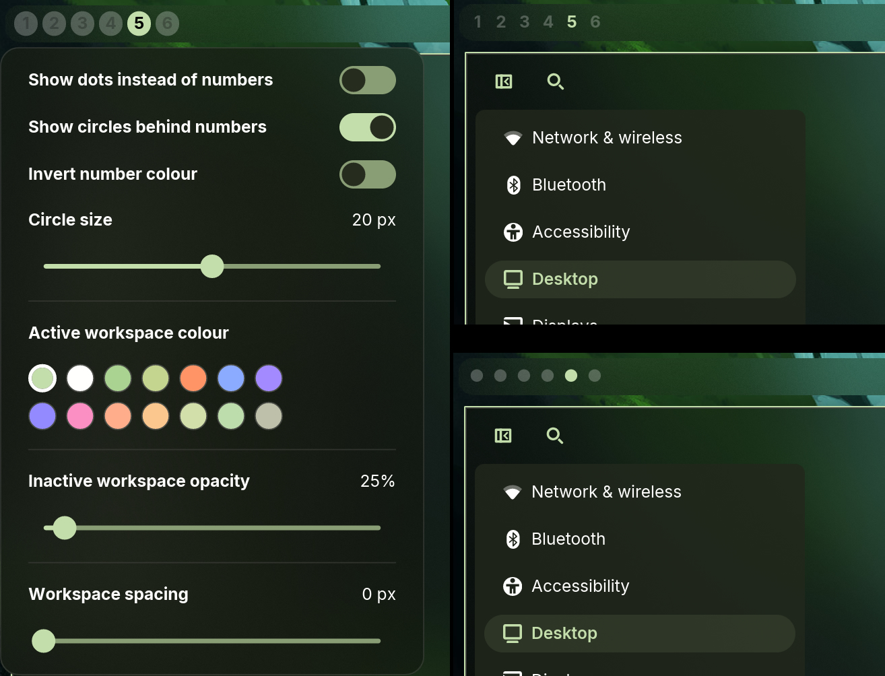

# Lowkey Workspaces

Fork of the COSMIC Numbered Workspaces applet. The active workspace just gets a coloured number instead of the accent circle. Right click it to change the colour, fade inactive workspaces, show dots instead of numbers or, adjust the spacing.

Install (needs Rust and just):

    just install

Then add Lowkey Workspaces to your panel in COSMIC Settings.

Uninstall:

    just uninstall

GPL-3.0, based on https://github.com/pop-os/cosmic-applets
